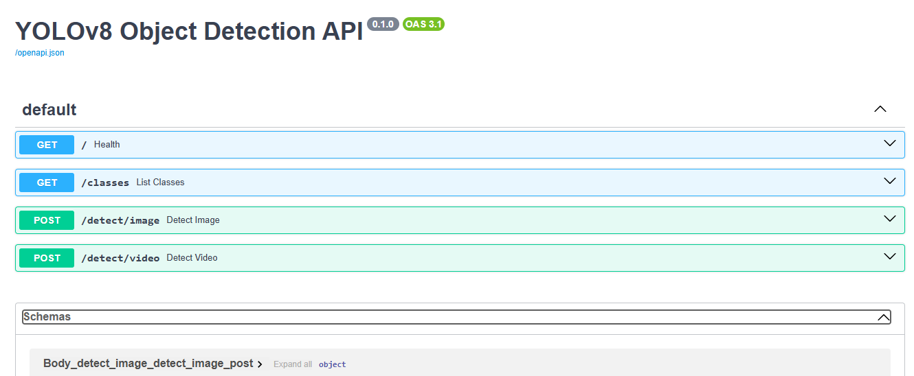
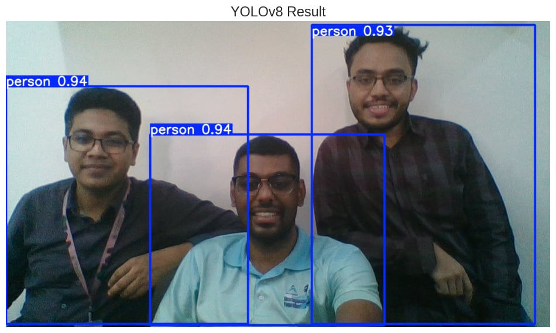
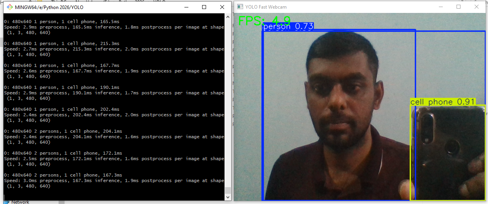

#  Real-Time Object Detection with YOLOv8 (FastAPI)

##  Description  
This project implements a real-time object detection system using a pretrained YOLOv8 model served through a FastAPI backend.  

It allows users to upload images and videos via API endpoints, perform object detection, and receive annotated outputs. A separate webcam script enables live detection by sending frames to the API.  

The YOLOv8 model is pretrained on the COCO dataset (80 object classes) and works out of the box.

---

##  API Endpoints  

###  GET /  
**Description:** Health check endpoint  
```json
{
  "status": "ok",
  "model": "yolov8n"
}
```

###  GET /classes  
**Description:** Returns all COCO class names  
```json
{
  "classes": ["person", "bicycle", "car", "dog", "..."]
}
```

###  POST /detect/image  
**Description:** Detect objects in an uploaded image  

**Input:**  
- file (required): Image file (JPEG/PNG)  
- confidence (optional): float (default = 0.4)  
- classes (optional): comma-separated class names  

**Output:**  
- Annotated image (JPEG)  
- Response header:  
```
X-Detections: {'person': 3}
```

###  POST /detect/video  
**Description:** Detect objects in an uploaded video  

**Input:**  
- file (required): Video file (MP4)  
- confidence (optional)  
- classes (optional)  

**Output:**  
- Annotated video (MP4 stream)

---

##  Installation & Setup  

```bash
# Clone repository
git clone <your-github-repo-link>
cd yolo-detection

# Install dependencies
pip install -r requirements.txt

# Start FastAPI server
fastapi dev main.py
```

Access Swagger UI:  
http://localhost:8000/docs  

---

##  Testing  

```bash
python test_api.py
```

Expected output:  
```
Detections: {'person': 3}
```

---

##  Webcam Detection  

```bash
python webcam.py
```

- Captures live video from webcam  
- Sends frames to the API  
- Displays annotated output  

Press `q` to exit.

---

##  Screenshots  

### Swagger UI  


### Object Detection  


### Webcam Detection  


---
